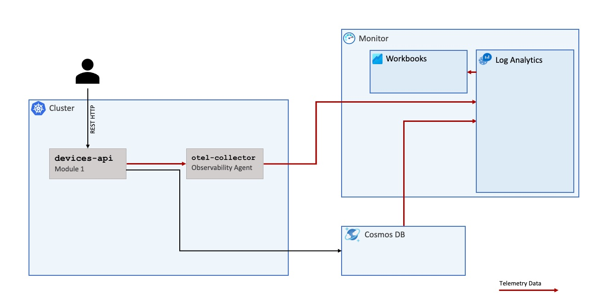

# Sample application

## Overview

This project contains a sample device API that creates and retrieves devices from a [Cosmos DB](https://learn.microsoft.com/en-us/azure/cosmos-db/introduction). Both the device API, as well as Cosmos DB, exposes telemetry data, to either be sent to [Log Analytics Workspace](https://learn.microsoft.com/en-us/azure/azure-monitor/logs/log-analytics-workspace-overview) or exporter by a telemetry agent like [OTEL-Collector](https://opentelemetry.io/docs/collector/).



## How to run

```bash
cd sample-application

docker compose up --build
```

Currently, the docker-compose file starts one java service - devices-api.
After executing the command above go to http://localhost:8080/devices. The response should show an empty list.
