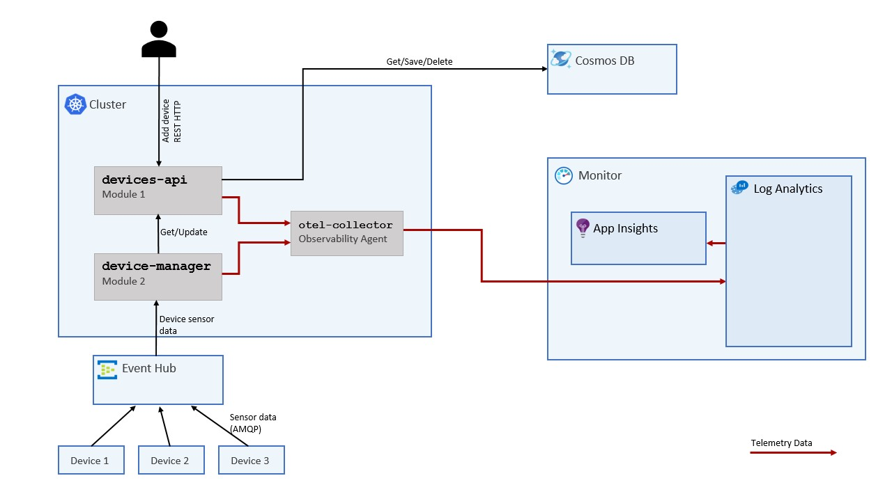

# Sample application

## Overview

This project contains a `devices-api` module (Java) which creates and retrieves devices from a [Cosmos DB](https://learn.microsoft.com/en-us/azure/cosmos-db/introduction) instance. Device is an entity which contains a status (e.g. 'new', 'in use') and the current sensor data (e.g. temperature). The sensor data for devices is generated using the [IoT Telemetry Simulator](https://github.com/Azure-Samples/Iot-Telemetry-Simulator). The simulated data is sent to the `device-manager` module (C#) via an Event Hub using AMQP. The `device-manager` updates the status and the current sensor value of a device by calling the `devices-api` module, which then updates the device in Cosmos DB.

The device API, device manager, as well as Cosmos DB, expose telemetry data, to either be sent to [Log Analytics Workspace](https://learn.microsoft.com/en-us/azure/azure-monitor/logs/log-analytics-workspace-overview) or exported by a telemetry agent like [OTEL-Collector](https://opentelemetry.io/docs/collector/).



## How to run

Create `.env` file and set `EVENT_HUB_CONNECTION_STRING` with Event Hub connection string.

```bash
cd sample-application

docker compose up --build
```

Currently, the docker-compose file starts the following components:
* `devices-api` - a java service
* `device-manager` - .NET console application
* OpenTelemetry collector
* [Devices Data Simulator](https://learn.microsoft.com/en-us/samples/azure-samples/iot-telemetry-simulator/azure-iot-device-telemetry-simulator/)

After executing the command above go to http://localhost:8080/devices. The response should show an empty list.
